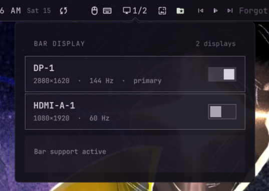

# BarDisplay

Show or hide the Omarchy bar per display.

A bar-widget button + a popup that lists every monitor with a toggle, its
resolution and refresh rate. Turning a display off hides the bar there; the bar
always stays visible on at least one display. Works with the Shibumi bar and
the default Omarchy bar.

<p align="center">
  
</p>

## Install

Copy the plugin into the Omarchy plugin directory and add it to your bar:

```sh
cp -r ~/Work/BarDisplay ~/.config/omarchy/plugins/dev.deoxizn.bardisplay
omarchy bar put dev.deoxizn.bardisplay --section right
```

Or drop the widget into `bar.layout.right` in `~/.config/omarchy/shell.json`
manually. The shell hot-reloads plugins and the bar.

## How it works

- A headless `service` owns the state. The set of displays the bar appears on
  is stored in `~/.config/omarchy/shell.json` under `bar.monitors`; an empty
  list means "every display" (the default, so nothing changes out of the box).
- Toggling a display writes `bar.monitors` and pushes the list straight into
  the running bar, so panels appear/disappear without a restart.
- Bar plugins have no native per-display toggle, so the service also runs
  `scripts/ensure-bar-support.sh` against the active bar's QML. That patch is
  idempotent (skips when already applied), backs the file up first, and refuses
  to touch the bar if its structure changed after an update — so it can't break
  the bar, it just re-applies the support when an update wipes it.
- The default Omarchy bar lives in root-owned `/usr/share/omarchy`, so patching
  it needs a one-time admin grant. The panel shows an **Apply** button that runs
  the same script through `pkexec`; the support re-applies itself after updates
  (the panel will ask again).
- The widget and its popup live in one `Panel.qml` entry point (like Omabench).
  The `KeyboardPanel` is a direct child of the widget root, which the Shibumi
  host relies on to anchor the popup to the visible bar edge and size it to the
  real content — don't wrap it in a `Loader` or inner `Item`.
- Physical resolution and refresh rates come from `hyprctl monitors -j`
  (Hyprland), fetched once by the service at startup. Quickshell screens only
  report logical (scale-divided) pixels, so the physical width/height would
  otherwise read wrong on scaled displays.

## Uninstall

```sh
rm -rf ~/.config/omarchy/plugins/dev.deoxizn.bardisplay
```

Remove the widget from `bar.layout` in `shell.json`, and if you want to revert
the bar itself, restore the backup the support script keeps next to the patched
file (`Bar.qml.bardisplay.bak`).
